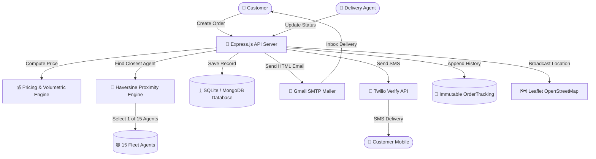

# 🚚 Last-Mile Delivery Tracker — Enterprise Logistics SaaS Platform

[](https://react.dev/)
[](https://expressjs.com/)
[](https://www.prisma.io/)
[](https://leafletjs.com/)
[](https://nodemailer.com/)
[](https://www.twilio.com/)
[]()

---

## 🌟 Executive Summary & Problem Statement

In last-mile logistics, **80% of customer churn** stems from uncoordinated agent dispatch, opaque tracking, and failed delivery attempts. **Last-Mile Delivery Tracker** is a production-ready, full-stack logistics intelligence platform designed to eliminate last-mile opacity.

It combines **real-time OpenStreetMap agent visualization**, **nearest-neighbor Haversine auto-assignment algorithms**, **multi-channel Gmail SMTP and Twilio SMS notification pipelines**, and **self-service failed delivery recovery** into a sleek, glassmorphic web application.

---

## 🚀 Key Feature Matrix (33 Core Innovations)

### 🗺️ 1. Real-Time Leaflet OpenStreetMap Engine
- **15 Active Fleet Agents Rendered**: Simultaneously displays 15 live delivery agents across Delhi-NCR (`🟢 Available`, `🟠 Busy`, `⚫ Offline`).
- **Dynamic Proximity Fitting**: Custom map canvas bounds auto-adjust to show agent density and route polyline trajectories.
- **Interactive Marker Popups**: Click any agent marker to view vehicle type (`EV Bike`, `Cargo Van`, `Scooter`), active workload, and GPS accuracy.

### 🧠 2. Smart Nearest-Neighbor Auto-Assignment
- **Haversine Distance Scoring**: Computes spherical distance between pickup coordinates and all available fleet agents.
- **Workload Penalty Balancing**: Integrates active order count penalties to prevent agent burnout.
- **Dynamic Re-Assignment**: When an agent becomes busy, the next nearest available agent is dynamically selected on subsequent orders.

### 💰 3. Volumetric Weight & Dynamic Rate Engine
- **Volumetric Formula**: `(Length × Breadth × Height) / 5000` (in kg).
- **Billable Weight Selection**: Automatically selects `Max(Actual Weight, Volumetric Weight)`.
- **Zonal Matrix**: Inter-Zone vs Intra-Zone rate card engine supporting COD surcharges and B2B/B2C billing modes.

### 📦 4. 4-Step Order Creation Wizard
- **Item Autodetect**: Automatically detects item categories (`Electronics`, `Apparel`, `Documents`, `Perishables`) and attaches visual badges.
- **Handling Flags**: Toggle `Fragile`, `Handle With Care`, and `Keep Upright` warnings.
- **Live Price Explainer Modal**: Shows line-by-line breakdown of base delivery charge, volumetric surge, and COD fees.

### 🔔 5. Multi-Channel Email & SMS Notification Engine
- **Gmail SMTP HTML Emails**: Rich HTML email templates delivered directly to customer & agent inboxes with order badges and tracking links.
- **Twilio Verify SMS**: Redesigned SMS pattern engine sending formatted SMS alerts (`[Last-Mile Tracker] 🚴 Out For Delivery #ORD-xxx!`) directly to recipient mobile numbers via Twilio Verify API.
- **Audit Persistence**: Every email and SMS is archived in the `NotificationLog` table.

### 🔄 6. Failed Delivery Recovery & Rescheduling Pipeline
- **Agent Failure Trigger**: Agents can mark delivery attempts as failed with specific reasons (`Customer Unavailable`, `Incorrect Address`, `Refused Delivery`).
- **Customer Self-Service Portal**: Customers receive instant alerts and can select a new delivery date and time slot from their portal.
- **Agent Re-Assignment**: Automatically releases the current agent and re-assigns the nearest agent for the rescheduled window.

### 🛡️ 7. Copilot AI & Admin Operations Center
- **AI Logistics Copilot**: Natural language assistant providing real-time fleet analytics, SLA breach warnings, and zone capacity advice.
- **Delivery Lifecycle Simulator**: Controlled testing tool for triggering live status progressions (`CREATED` $\rightarrow$ `ASSIGNED` $\rightarrow$ `PICKED_UP` $\rightarrow$ `IN_TRANSIT` $\rightarrow$ `OUT_FOR_DELIVERY` $\rightarrow$ `DELIVERED`).
- **Proof of Delivery (POD)**: Digital OTP verification and recipient signature confirmation on final handover.

---

## 🏗️ System Architecture



---

## 💻 Tech Stack & Dependencies

| Layer | Technology | Purpose |
| :--- | :--- | :--- |
| **Frontend** | React 18, Vite, TailwindCSS | High-performance, responsive glassmorphic UI |
| **Mapping** | Leaflet.js, React-Leaflet, OpenStreetMap | Free, interactive vector map visualization |
| **Backend** | Node.js, Express.js | REST API server with middleware validation |
| **Database** | Prisma ORM, SQLite / MongoDB | Zero-latency relational data management |
| **Email Engine** | Nodemailer, Gmail SMTP | HTML transactional email delivery |
| **SMS Engine** | Twilio REST API, Twilio Verify API | Multi-channel mobile SMS notifications |
| **Icons & Style** | Lucide React, Google Fonts (Plus Jakarta Sans) | Modern typography and micro-interactions |

---

## ⚡ Quick Start & Installation

### Prerequisites
- Node.js v18+ 
- npm / npx

### 1. Clone & Install Dependencies
```bash
# Clone the repository
git clone https://github.com/SaanyaGarg01/backend.git
cd backend

# Install backend dependencies
npm install

# Install frontend dependencies
npm install --prefix client
```

### 2. Environment Configuration
Create a `.env` file in the root directory (or update existing):
```env
PORT=5000
NODE_ENV=development
DATABASE_URL="file:./dev.db"
JWT_SECRET="last-mile-delivery-tracker-super-secret-jwt-key-2026"
FRONTEND_URL="http://localhost:5173"

# Email Configuration (Gmail SMTP)
SMTP_HOST=smtp.gmail.com
SMTP_PORT=587
SMTP_USER=saanyagarg400@gmail.com
SMTP_PASS=your-16-digit-gmail-app-password
SMTP_FROM="Last-Mile Tracker <saanyagarg400@gmail.com>"

# SMS Configuration (Twilio)
TWILIO_ACCOUNT_SID=your_twilio_account_sid
TWILIO_AUTH_TOKEN=your_twilio_auth_token
TWILIO_PHONE_NUMBER=+17372212163
TWILIO_VERIFY_SERVICE_SID=your_verify_service_sid
```

### 3. Database Migration & Agent Seeding
```bash
# Push Prisma schema and generate client
npx prisma db push
npx prisma generate

# Seed 15 NCR Fleet Agents into database
node scratch/seed_15_agents.js
```

### 4. Launch Application Servers
```bash
# Terminal 1: Start Express Backend API (Port 5000)
node src/server.js

# Terminal 2: Start Vite React Frontend (Port 5173)
npm run dev --prefix client
```

Now open **[http://localhost:5173](http://localhost:5173)** in your browser!

---

## 🔑 Demo Access Credentials

| Role | Email | Password | Access Portal |
| :--- | :--- | :--- | :--- |
| 🛡️ **Admin** | `admin@example.com` | `admin123` | `/admin` (Mission Control) |
| 🚚 **Delivery Agent** | `agent@example.com` | `password123` | `/agent` (Agent Hub) |
| 👤 **Customer** | `customer@example.com` | `password123` | `/customer` (Dashboard) |

---

## 🧪 Automated End-to-End Test Suite

Run the full automated verification suite to test all 33 core features:
```bash
node scratch/verify_all_33_features.js
```

**Expected Output**:
```text
====================================================
🎉 ALL 33 CORE FEATURES VERIFIED AND RUNNING CLEANLY!
====================================================
```

---

## 📄 License & Contact

Developed for hackathons and production SaaS demonstrations.  
For inquiries or support, contact **Saanya Garg** (`saanyagarg400@gmail.com`).
